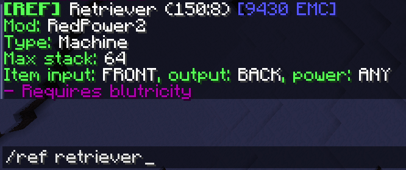

# TekkitReference

A manual plugin made for Tekkit Classic (3.1.2). Retrieves item information from a MySQL database.

Please report any bugs and issues [here](../../issues/).
### Usage
**General commands**  
*Permission: tekkitreference.ref*
- `/ref <item name> [filter]`  
- `/ref look`  
- `/ref hand`  

**Administrator commands**  
*Permission: tekkitreference.admin*
- `/ref admin reload`  

**Availible filters**
- `all`

### Setup
1. Download JAR and move it to your `plugins` folder.  
2. Reload/restart/start your server once to create the config file.  

**Optional steps for better performance:**  
3. Setup a MySQL server locally and import the database from the .sql file.  
4. Modify the config.yml to match your MySQL server's settings.  
5. Reload/restart your server. Check your console if the SQL connection succeeded.

### Changelog
**v1.0.0**  
Initial version

### TODO
- Item ID as search term
- Add more items to the database